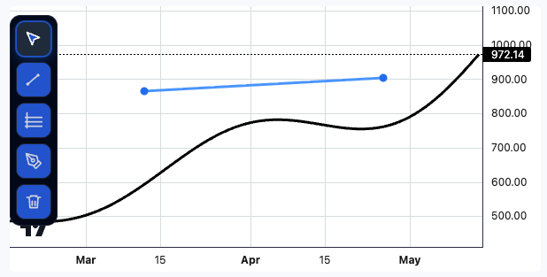

# Drawing Tools - Lightweight Charts™ Plugin

Description of the Plugin.

- Developed for Lightweight Charts version: `v5.0.0`
- Demo: [View Demo](https://prithvi101.github.io/lwc-drawing-tools/) (if applicable, otherwise omit or keep simple)

## Features & Usage



This plugin adds a toolbar with drawing capabilities to your Lightweight Chart.

### 1. Trendline Tool
- **Icon**: Diagonal Line with dots.
- **Usage**: Click to set the start point, move to the desired end point, and click again to finalize the line.
- **Interaction**: Click to select, drag points to resizing, or drag the line to move it.

### 2. Fibonacci Retracement
- **Icon**: Horizontal lines.
- **Usage**: Click to set the start point (e.g., swing low), move to the end point (e.g., swing high), and click to finish.
- **Features**: Automatically draws standard Fibonacci levels (0, 0.236, 0.382, 0.5, 0.618, 0.786, 1) with specific colors and price labels.
- **Interaction**: Select and drag the main trendline to move the entire retracement tool.

### 3. Pen Tool (Freehand Marker)
- **Icon**: Pencil.
- **Usage**: Click and hold to draw freehand lines on the chart. Release to finish.
- **Features**: Smooth curve rendering using quadratic Bézier curves. Uses logical coordinates for precise drawing independent of candle snapping.
- **Interaction**: Select and drag the drawing to move it.

### 4. Remover
- **Icon**: Trash / Eraser.
- **Usage**: Select this tool and click on any drawing to delete it.


## Installation

```shell
npm install lwc-plugin-drawing-tools
```

## Basic Usage

```javascript
import { createChart, LineSeries } from "lightweight-charts";
import { DrawingPlugin } from "lwc-plugin-drawing-tools";

const chart = createChart(document.getElementById("chart"), {
  width: 800,
  height: 600,
});

const series = chart.addSeries(LineSeries, { color: "blue" });
series.setData([...]); // Add your data here

// Initialize the Drawing Tools Plugin
const drawingTools = new DrawingPlugin({
  color: "#2962ff",    // Default line color
  lineWidth: 2,        // Line width in pixels
  showEndpoints: true, // Show dots at line endpoints
  toolBoxOffset: {     // Position of the toolbar relative to the chart
    x: 10, 
    y: 10 
  },
});

// Attach the plugin to a series
series.attachPrimitive(drawingTools);
```

## Configuration Options

You can pass an optional configuration object when creating the `DrawingPlugin` instance:

| Option | Type | Default | Description |
| :--- | :--- | :--- | :--- |
| `color` | `string` | `"rgba(32, 108, 237, 1)"` | The default color for trendlines and drawings (CSS color string). |
| `lineWidth` | `number` | `1` | The thickness of the drawing lines in pixels. |
| `showEndpoints` | `boolean` | `false` | If `true`, small dots are rendered at the start and end of selected lines. |
| `toolBoxOffset` | `{ x: number, y: number }` | `{ x: 10, y: 100 }` | The pixel offset for the toolbar position relative to the top-left corner of the chart container. |


